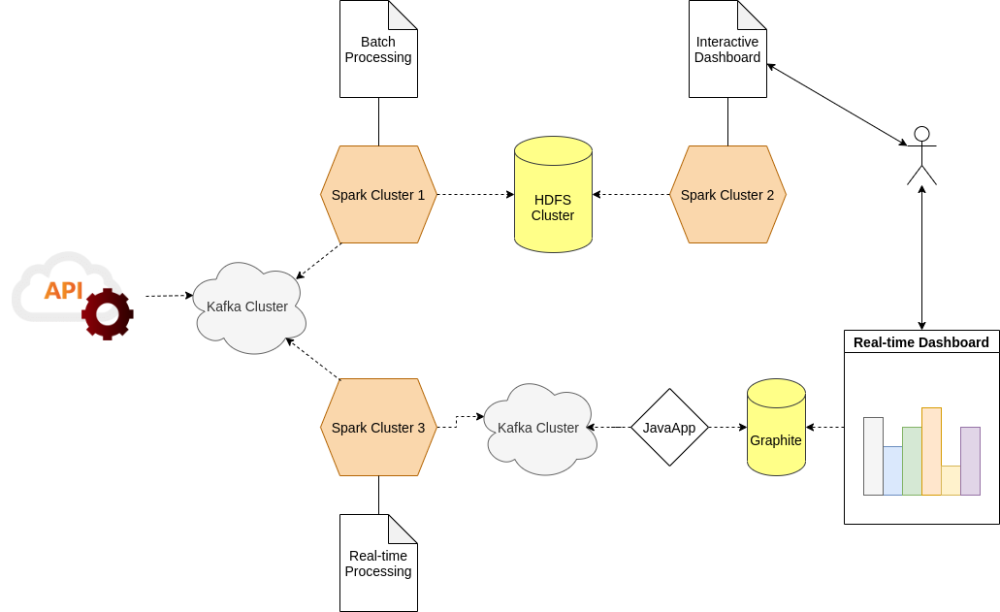
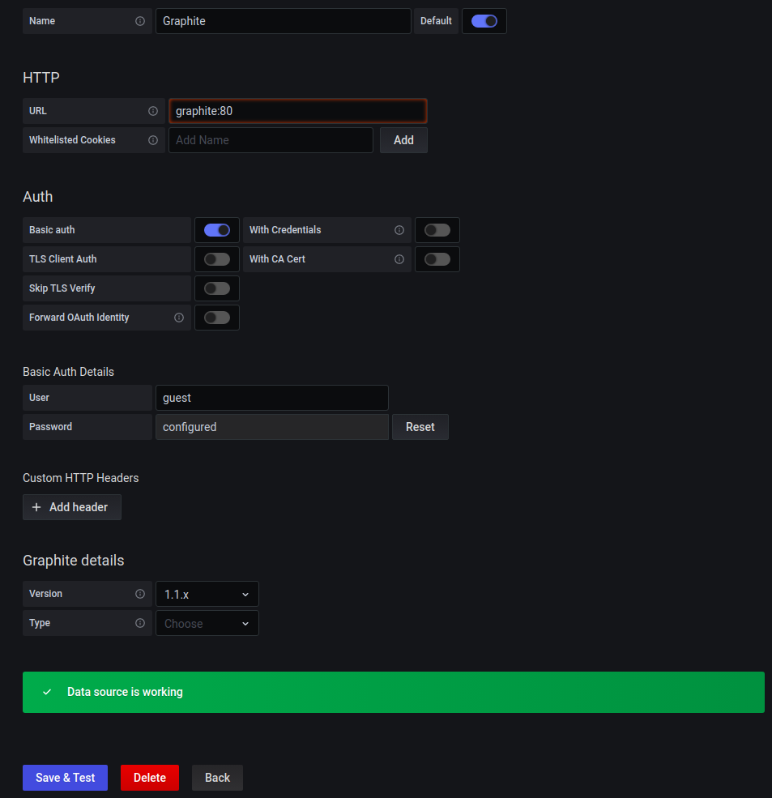
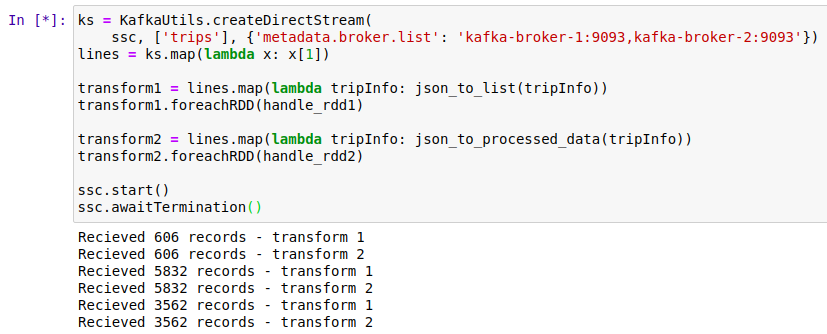
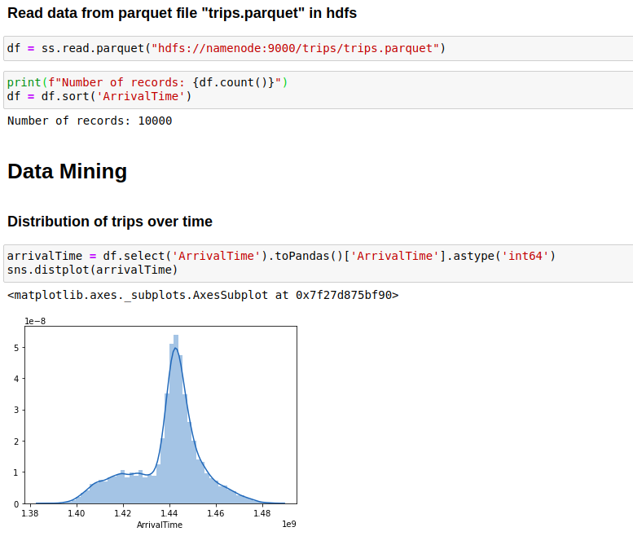
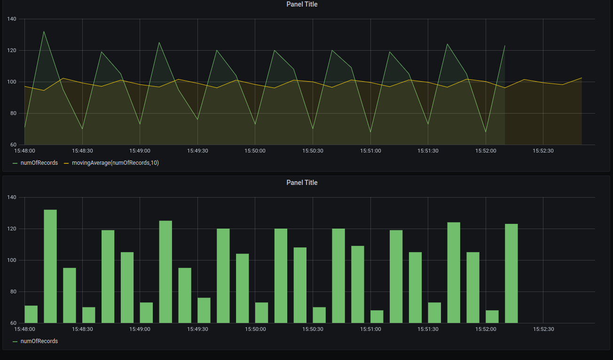

# Bigdata pipeline with Docker + Kafka + Spark + HDFS + Grafana

Introduction
===
Authors:
 - Vu Trung Nghia - nghia.vt173284@sis.hust.edu.vn
 - Le Vu Loi
 - Dang Lam San

In this project, we built a pipeline for storing and processing PNRs data

(https://developers.amadeus.com/blog/free-fake-pnr-sample-data)

The pipeline supports batch view and real-time view:
 - In batch view, user can using SQL api and python to query and visuzlie data in HDFS
 - For real-time view, we simple logs the number of recieved records every 10 seconds

How it works?
 - PNR's API produces records to a topic in kafka cluster.
 - Batch Processing program and Real-time Procesisng program subscribe to this topic, these programs use spark cluster 1 and spark cluster 3 as its computation resource.
 - Batch Processing program processes data and stores to HDFS. Then user can use Interactive Dashboard which is a notebook to read data from HDFS and do some statistics. This notebook use spark cluster 2 as its computation resource.
 - Real-time Processing program processes data and writes to another kafka topic, then the JavaApp subscribes to this topic to read data and write to Graphite database. Finally, Real-time Dashboard read datas from Graphite and visualizes.




Acknowledgement:
 - https://github.com/haiphucnguyen/BigDataDemo
 - http://www.diva-portal.org/smash/get/diva2:897808/FULLTEXT01.pdf
 - https://blog.softwaremill.com/7-mistakes-when-using-apache-kafka-44358cd9cd6
 - https://spark.apache.org/docs/latest/streaming-programming-guide.html
 - https://spark.apache.org/docs/latest/structured-streaming-kafka-integration.html
 - https://spark.apache.org/docs/1.5.2/sql-programming-guide.html
 - https://spark.apache.org/docs/latest/api/python/_modules/pyspark/sql/streaming.html

Setup
===
Prerequires:
 - Hardware:
   - RAM: 8 GB
   - Storage: 40GB
 - Software:
   - python 3.8
   - pip install kafka-python==2.0.2
   - docker version 20.10.1, build 831ebea
   - docker-compose version 1.25.0
   - ubuntu 20.04
 - Have basic knowledge of kafka, spark, hdfs, python and jupyter notebook


Create docker network name: bigdata
```
docker network create bigdata
```
Remove all containers (The below command will remove all containers whether it is running or not)
```bash
docker rm -f $(docker ps -a -q)
```
Start bigdata cluster
```bash
docker-compose -f docker-compose.yml up -d
```
Go to browser at: `localhost:8888` and enter `password`: `admin`

From notebook GUI, open a terminal and run the following commands to create `trips` and `real-time-statistic` topics
```
cd ~/kafka
bin/kafka-topics.sh --create --topic trips --partitions 2 --replication-factor 2 --bootstrap-server kafka-broker-1:9093,kafka-broker-2:9093
bin/kafka-topics.sh --create --topic real-time-statistic --partitions 2 --replication-factor 2 --bootstrap-server kafka-broker-1:9093,kafka-broker-2:9093

# decribe created topics (optional)
bin/kafka-topics.sh --describe --topic trips --bootstrap-server kafka-broker-1:9093,kafka-broker-2:9093
bin/kafka-topics.sh --describe --topic real-time-statistic --bootstrap-server kafka-broker-1:9093,kafka-broker-2:9093
# decribe created topics from local machine (optional, you computer must install kafka)
bin/kafka-topics.sh --describe --topic trips --bootstrap-server localhost:9092,localhost:9094
bin/kafka-topics.sh --describe --topic real-time-statistic --bootstrap-server localhost:9092,localhost:9094
```

Go to `localhost:8888` again and open 3 notebooks in folder `work`:
 - `batch-processing.ipynb`
 - `dashboard.ipynb`
 - `speed-processing.ipynb`

Run all cells:
 - `batch-processing.ipynb`: listen on topic `trips` => process data => save to hdfs
 - `speed-processing.ipynb`: listen on topic `trips` => process data => write to topic `real-time-statistic`

Run java app to consume topic `real-time-statistic` and write result to graphite
 - Go to `localhost:8888` and open terminal
```
cd ~/work
java -jar app/KafkafToGraphite.jar
```

Take a look at spark master at: `localhost:8082`, `localhost:8083`, `localhost:8084`

Take a look at hdfs at: `localhost:50070`

To access graphite web UI, type `localhost:8880` on your browser

To access grafana web UI, type `localhost:3000` on your browser. The credentials are:
- `username`: `admin`
- `password`: `admin`

Add data source in grafana. On the left bar: `Configuration` => `Data Sources` => `Add data source`. Choose Graphite from the list. The configuration are:
- URL: `graphite:80`
- Click `Save & Test`



Create dashboard in grafana
 - On the left bar: `+` => `import` => choose dashboard json at: `dashboard/dashboard.json`

Produce records from your local machine (your machine must install kafka-python==2.0.2)
```
python simulation/producer.py --n 10000 --delay 0.1
```
After run produce command, in `batch-processing.ipynb` you should see the logs which count the recieved records



Go to `dashboard.ipynb` and run all to see the statistics and anomaly detection results




Go to grafana UI dashboard to see the graph which show the number of recieved records every 10 seconds





Utilize command
---
```bash
docker ps --format "table {{.Image}}\t{{.Names}}"
```
